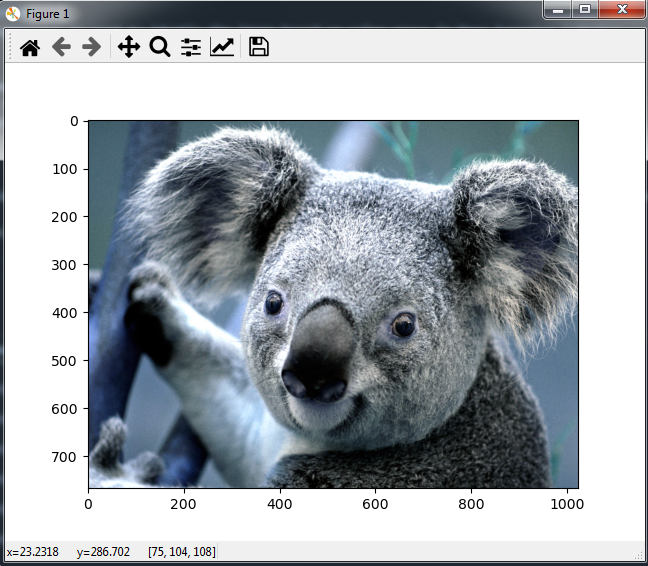
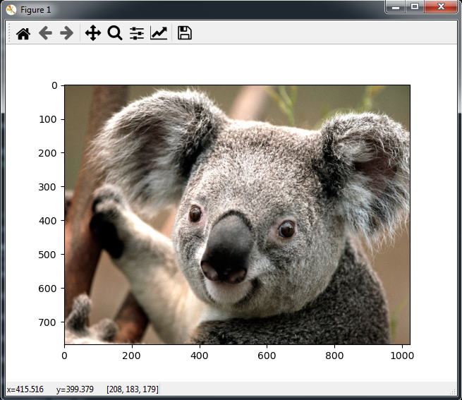
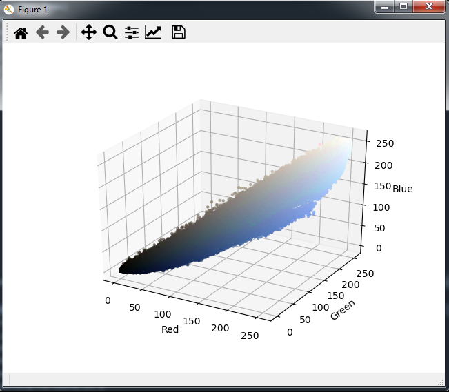
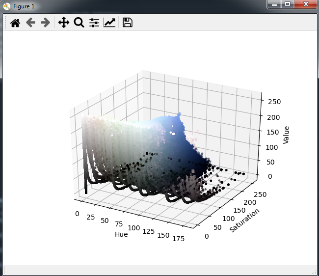

# Image segmentation
    The image segmention is used to identiy the image based on color specs in Deep learning industry

# Dependencies
    Opencv - computer vision library
    matplotlip- Visualize the data
    numpy- library supporting array and reshaping

# To run  

    upload the image to  images folder and change the name in line 10 and enter below the command to run

    python image.py

# Demo

    when first time ploting in cv the image is always in BGR format

   

    Converted to RGB the orignal image will be returned
    

    
    Visulaizing the RGB 

    visulizing the HSV - Hue saturation and value(brightness)

* You can also add more functionalities to the segmentation by adding
    
    you can select the colors from image to segment the image by different colors

    also yo can add Gaussian blur fuction is used to transform each pixel in the image and smoothing the image

